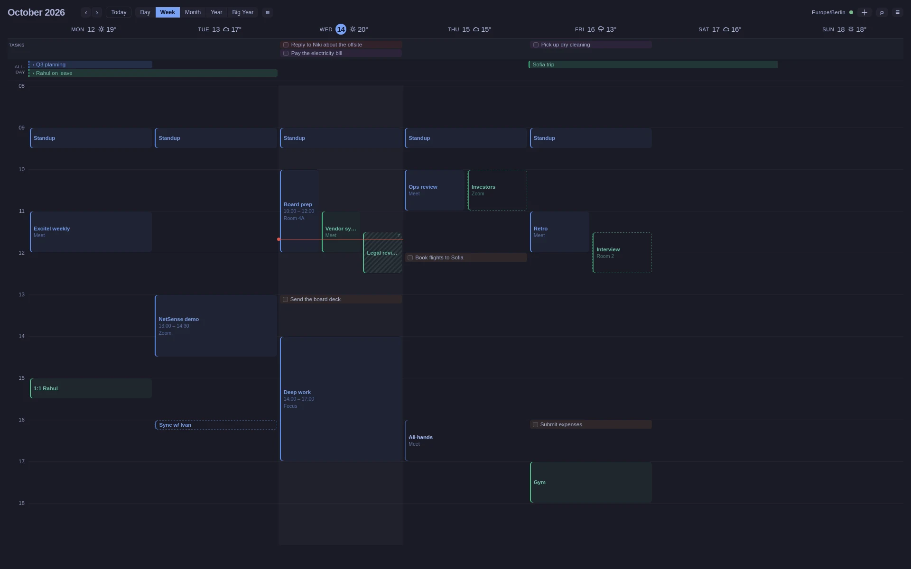

# OmaCal

A desktop calendar for Omarchy Linux — **Google Calendar, iCloud, or any
CalDAV server**, with full create/edit/RSVP including recurring events at
all three scopes, and a signed, notarized macOS build for the days you're
not at the Arch machine. Tauri v2, Rust, Svelte 5. **No servers**: your
events live in a local database, your tokens in your keyring, and nothing
of yours passes through us.

Most of what a calendar must do, every calendar does. What earns OmaCal
its place:

## Your terminal and your agent read the same calendar

The app binary is also a CLI. Reads come straight off the local database —
no network, no re-auth, working offline:

    omacal agenda --json
    omacal events list --from 2026-09-01 --to 2026-09-05 --json
    omacal search quarterly review

Writes — `events create / update / delete / respond` — are executed by the
running app over a local socket, behind the same guards its own form has:
the CLI **refuses to guess** which occurrences of a repeating event you
mean, or whether guests get emailed. Stable JSON envelope, stable exit
codes, never prompts.

And wiring a coding agent is one command:

    omacal skill install

The agent skill ships inside the binary and **every update silently
refreshes the installed copy**, so your agent never reads instructions for
a binary that no longer matches. `omacal skill` prints it for any other
framework; `omacal commands --json` is the machine-readable catalog.

## Built into Omarchy, not just running on it

Colours come from your Omarchy theme and follow `omarchy-theme-set` live,
no restart. Installing also installs (and keeps updated) the
`omacal.upcoming` bar widget: what's running now, today's remaining
meetings, due tasks.

## An invitation cannot slip past you

A new invitation posts a desktop notification the moment sync sees it, and
it **stays on screen until you deal with it** — click accepts the series.
Miss it anyway and the header's envelope tray still holds it, with
Yes / Maybe / No — alongside the rest of your meetings' news: who declined
a meeting you organize, what got rescheduled ("Tue 15:30 → Wed 15:30"),
what was cancelled. Deliberately quiet: only the invitation itself
notifies; everything else is news in the app, not an interruption.

## It never emails people on your behalf

Dragging an event with guests asks first — *Move without notifying* is the
default. Saving an edit **asks who to tell** rather than mailing the room;
fixing a typo in an address notifies nobody. On CalDAV, edits are
etag-guarded: a change that raced another device tells you instead of
clobbering.

## Sign-in with nothing to configure

**No API key, no Google Cloud project, nothing to create.** Installed
builds carry OmaCal's own Google-verified client — connecting is the
ordinary consent screen and that's it. iCloud connects with an
app-specific password from appleid.apple.com; any other CalDAV server
with its own URL. CalDAV **task lists** (VTODO) come along, manageable
from the app.

## Install

    curl -fsSL https://extremelabs.io/omacal/install.sh | sh

One line for Linux x86_64 and macOS on Apple Silicon. On Linux the AppImage
lands in `~/.local/bin` with a desktop entry; on a Mac, OmaCal.app lands in
Applications with the `omacal` command on your PATH, signed and notarized,
no right-click ritual. From then on the app updates itself: when a release
exists, the header grows an **Update** button. A native `.deb` and `.rpm`
are on the [releases page](https://github.com/x3me/omacal/releases), and so
is the [.dmg](https://github.com/x3me/omacal/releases/latest/download/omacal.dmg)
for anyone who would rather drag than paste.

First sign-in stores the token in your keyring, so a minimal Hyprland
session needs gnome-keyring, KeePassXC or kwallet running.

## Updating

**Usually nothing.** When a newer release exists, the header grows an
**Update** button; one click fetches it, checks its signature and restarts.
That is the AppImage and the macOS app both.

Otherwise, by how you installed it:

- **From the install line**, Linux or Mac — re-run the same line any time.
  It replaces the installed copy with the current release.
- **`.deb` / `.rpm`** — these do not self-update. Take the new package from
  the [releases page](https://github.com/x3me/omacal/releases) and install it
  over the old one.
- **An AppImage manager** (AppImageUpdate, appimaged, AppManager) — the
  released AppImage carries AppImage update information and publishes a
  `.zsync` beside it, so these update it in place.

Which version you are on: the footer of Settings prints it, and so does
`omacal doctor`.

## The rest, briefly

Five views (Day to a whole-year 14-row ribbon), keyboard-first — press
`?` for every key. A list mode that **leaves empty days out**: a quiet
month is four rows, not thirty-one headers. Search that resolves a
recurring event to one result. Multiple accounts; per-calendar colours
that stay local and never touch Google. Reminders that mirror what your
phone fires, with editable fallbacks for shared calendars that have none.

**Video calls:** Add Video Call creates Google Meet through the target
calendar or a unique scheduled Zoom meeting after a one-time Zoom
connection in Settings → Accounts. The attendee link is attached before
invitations go out; pasting an existing Zoom link remains a no-login
fallback.

Building from source and using your own Google credentials:
[`docs/running-on-omarchy.md`](docs/running-on-omarchy.md) ·
[`docs/running-on-macos.md`](docs/running-on-macos.md). The design record
lives under [`docs/superpowers/`](docs/superpowers/).

## License

MIT — see [`LICENSE`](LICENSE).
