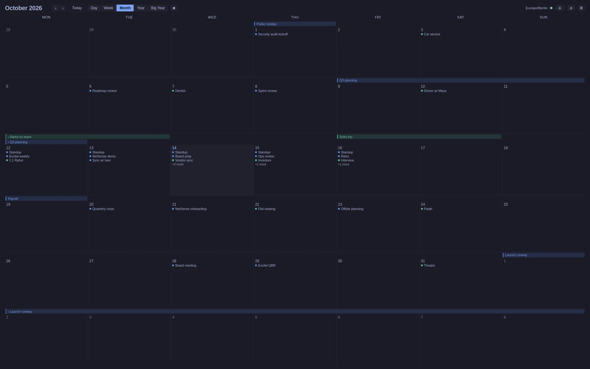
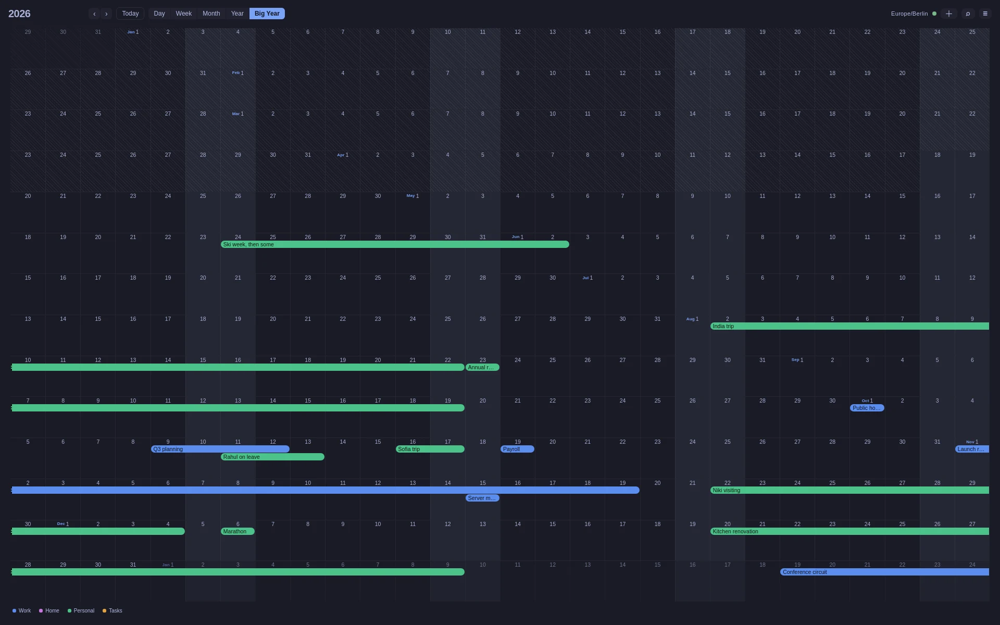

# omacal

A minimal desktop calendar client. Five views, live background sync, and
full create/edit/delete against your real calendar — **Google Calendar,
iCloud, or any CalDAV server**, including CalDAV **task lists** (VTODO)
with tasks fully manageable (complete, add, delete) from the app. Meeting
**invitations announce themselves** and can be accepted with one click, and
the header's tray keeps score of everything that changed around your
meetings: who declined, what moved, what was cancelled. A **read-only CLI**
rides in the same binary — `omacal agenda --json` — with a shipped agent
skill, so your terminal and your coding agent read the same calendar the
app draws. Built with Tauri v2, Rust and Svelte 5, for Omarchy Linux
first — with a signed, notarized macOS build alongside.

iCloud connects with an app-specific password from appleid.apple.com — no
OAuth dance. Edits on CalDAV events are etag-guarded (a change that raced
another device tells you instead of clobbering); the one thing CalDAV
calendars don't do yet is guest management, which stays a Google feature
for now. Note that iCloud's CalDAV carries calendars and legacy task lists
only — Apple's own Reminders app moved to a private store in 2019 and no
third-party app can reach it.

Colour comes from your Omarchy theme and follows `omarchy-theme-set` live, with
no restart.

## Install

    curl -fsSL https://extremelabs.io/omacal/install.sh | sh

Linux, x86_64. The latest release AppImage lands in `~/.local/bin/omacal` with
a desktop entry. When a newer release exists the app says so in its header,
and on this install path the notice carries an **Update button** — one click
downloads the signed release, verifies it, and restarts. (Re-running the line
above still works too.) The AppImage needs FUSE2 — stock Ubuntu 24.04+
doesn't ship it, and the installer offers to add it there.

**On Debian/Ubuntu**, the `.deb` from the [releases
page](https://github.com/x3me/omacal/releases) is the native path — no FUSE
needed, dependencies resolved by apt:

    sudo apt install ./omacal_<version>_amd64.deb

The `.rpm` on the same page covers Fedora-family the same way.

**On macOS** (Apple Silicon): [download the
.dmg](https://github.com/x3me/omacal/releases/latest/download/omacal.dmg),
drag omacal to Applications, double-click — the build is signed with a
Developer ID certificate and notarized by Apple, so there is no
right-click ritual and no warning. From v0.5.0 on it updates itself the
same way the AppImage does: the header's notice carries an Update button.
(A build older than 0.5.0 is unsigned — update it by hand once via
right-click → Open, and the button takes over.)

Then run `omacal` and click **Connect Google Calendar** — and that is the
whole setup. **You do not need your own Google credentials, an API key, or a
Google Cloud project. Nothing to create, nothing to configure.** Installed
builds ship with omacal's own Google-verified sign-in, so connecting is the
ordinary Google consent screen and nothing else. (There is an optional
power-user section near the bottom about using your own credentials — if
you're wondering whether it applies to you, it doesn't.)

One thing worth knowing on first sign-in: the token lands in your keyring,
so a minimal Hyprland session needs gnome-keyring, KeePassXC or kwallet
running.

## What it does

**Five views** — Day, Week, Month, Year (12-up) and Big Year (a 14-row ribbon of
the whole year). Keys `1`–`5` switch between them; `h`/`l` step back and forward,
`t` returns to today, `n` starts a new event, `/` opens search, `f` switches
between grid and list, and `Escape` closes whatever is open. **Press `?` for the
full list** — you never have to remember which key does what.

| Month | Big Year |
| --- | --- |
|  |  |

**List mode** — the `▦`/`☰` control beside the view switcher, or `f`. It draws
Day, Week and Month as a list of days rather than a grid, showing the time,
title, calendar colour and location of each event, with all-day events first on
their day. **Days with nothing on them are left out**, which is the point: a
quiet month is four rows, not thirty-one headers. The choice sticks across views
and restarts. Year and Big Year keep their shape — they exist to be scanned
across a whole year, and the control is simply not there rather than there and
doing nothing. Dragging is a grid gesture, so it is absent in a list; `n` and the
event form still create.

**Multiple Google accounts**, with per-calendar control over what is *displayed*
and what is *fetched* — two separate switches, deliberately.

**Events** — click one for its details: guest list with each person's answer,
description, location, and a conferencing link when there is one. RSVP from the
popover. Create, edit and delete, including recurring events at three scopes:
this occurrence, this and following, all events.

**Drag** to move an event, resize it by an edge, or sweep empty grid to start a
new one. A drag never emails anybody by itself: moving an event with guests asks
first, and *Move without notifying* is the default answer. Sweeping opens the
event form pre-filled with the span rather than creating something untitled.

**Guests** — add somebody by address, remove them, mark them optional. A
brand-new event can carry guests from the start now, the same as one already on
your calendar — omacal used to refuse that. **Save asks who to tell** rather
than always mailing the room, which is the change worth knowing about if you
used an earlier build: correcting a typo in an address no longer notifies
everyone. The organizer cannot be removed, and removing *yourself* is offered
but is not the same as declining — that is what the RSVP buttons are for.

**Video calls** — **Add Video Call** offers Google Meet and Zoom. Google Meet
is created through the target Google Calendar; Zoom uses its own one-time PKCE
connection under **Settings → Accounts**, then creates a unique scheduled
meeting as the event is saved. The returned attendee link is attached to the
event before invitations go out. Pasting an existing `zoom.us` link remains a
no-login fallback, and existing meeting links are never removed when Zoom is
disconnected.

**Invitations** — a new invitation posts a desktop notification the moment
sync sees it, and the notification **stays on screen until you deal with it**:
on Omarchy, clicking it accepts the whole series (right-click dismisses
without answering). The header shows an envelope badge while anything awaits
you, opening a tray with Yes / Maybe / No on every unanswered invitation —
so a missed notification is never a missed invitation. The same tray carries
the rest of a meeting's news: **who declined** a meeting you organize, and
meetings you attend that were **rescheduled** ("Tue 15:30 → Wed 15:30") or
**cancelled** — each with an acknowledge ×, each section with Dismiss all.
Deliberately quiet: only the invitation itself notifies; everything else is
news in the app, not an interruption.

**The Omarchy bar widget** — installing omacal on Omarchy 4 also installs
(and keeps updated) an `omacal.upcoming` bar widget: a popup with what is
running now, today's remaining meetings, all-day spans, and due tasks, plus
Sync and Quit. Click its Open button and you land on the app wherever it
lives, workspaces notwithstanding.

**Search** — `/`, or the magnifier in the header. Titles only, results as you
type, nearest to today first in either direction. A recurring event is one
result rather than one per occurrence, resolved to the occurrence nearest today.
It searches only calendars you display: a result on a hidden calendar is one you
could not land on.

**The CLI** — the same binary reads the calendar from a terminal: `omacal
agenda` for the week ahead, `omacal events list --from … --to …`, `omacal
search <query>`, `omacal calendars` — each with `--json` for scripts and
agents (stable envelope, stable exit codes, never prompts, read-only by
design). `omacal cli-help` has the details, and `skills/omacal-calendar/`
in this repo is a ready-made agent skill for Claude Code: drop it into
`~/.claude/skills/` and your agent can answer "what's on my calendar
Thursday?" from the same data the app draws.

**Settings** — behind the hamburger, in four tabs. **General** carries the sync
interval — which used to require editing the database by hand — the calendar new
events land on, and whether times read as `13:30` or `1:30 PM` (the hour ruler
down the side of Day and Week follows the same choice). **Calendars** holds the same rows as the header's
picker, each with a **colour** you choose from a curated set — *local to
omacal*, never written to Google, so your phone, the web UI and anyone sharing
the calendar are untouched. **Accounts** lists what is connected, each with a
**Sign out** that removes the account's local data and, for Google, revokes
omacal's own access server-side. **Notifications** turns reminders on and off,
and holds the fallback reminders described below.

**Sync** runs every five minutes, on window focus, and after every write. Its
state is a small dot in the header rather than a sentence: quiet when everything
is current, and hovering says exactly when.

**Notifications** come from each event's own Google reminders, falling back to
the calendar's defaults, so what fires here matches what your phone does — and
the event form shows those reminders and lets you edit them, on create and on
edit. On a shared calendar where your account has no reminders at all, omacal's
own **fallback reminders** step in — 60 and 10 minutes out of the box, editable
in Settings → Notifications — never overriding an event's or a calendar's real
reminders, and never touching all-day events. Only `popup` reminders fire —
Google sends the email ones itself. One missed while
the app was shut fires at the next launch if the meeting has not ended yet.
There is a tray and start-on-login, and closing the window hides it rather than
quitting, because a closed window that stopped firing reminders would be a bug.
On macOS this needs a signed bundle to be reliable and omacal is unsigned, so
the path is wired but allowed to fail quietly; Omarchy is where it is built to
work, over D-Bus.

## What is not built

**Offline writes** — a save needs the network, and says so rather than queueing.

**Reliable notifications on macOS**, which needs a signed bundle; see above.
Click-to-accept on invitation notifications is likewise Omarchy's — macOS
still gets the tray.

All three residuals recorded in §7 of
[`docs/superpowers/specs/2026-08-08-omacal-form-time-boundary-design.md`](docs/superpowers/specs/2026-08-08-omacal-form-time-boundary-design.md)
are now closed. All-day events are placed by their own calendar's date rather
than your system zone (§7.1). Toggling **All day** off no longer lands on a span
Save refuses, and no longer quietly writes times invented from the calendar's
UTC offset (§7.2). A time typed into an hour that does not exist — a
daylight-saving spring-forward — is still refused, which is correct, but the
form now names it and says why instead of leaving Save dead with no field
looking wrong (§7.3).

## Building from source

    npm --prefix ui install               # once, after cloning
    OMACAL_SEED_DEMO=1 cargo tauri dev   # look at it now, with synthetic data
    cargo tauri dev                       # your real calendar (needs setup — see the guides)
    cargo test --workspace                # Rust suite
    npm --prefix ui run test:ui           # UI suite

A source build signs in with your own Google Cloud credentials via
`~/.config/omacal/config.toml`, which always wins over anything embedded.
Setup: [`docs/running-on-macos.md`](docs/running-on-macos.md) ·
[`docs/running-on-omarchy.md`](docs/running-on-omarchy.md)

## Optional: your own Google credentials

**Most people should skip this section — the installed app needs nothing
from it.** Sign-in works out of the box with omacal's own verified client,
as the Install section says. This exists for exactly two audiences: people
**building from source** (a source build carries no embedded client, so it
needs yours — see above), and power users who *prefer* their sign-in to run
under their own Google Cloud project, on their own quota, with us entirely
out of the loop. If neither is you, there is nothing to do here.

For those two: create a free Google Cloud project with the Calendar API and
a Desktop OAuth client, and put the pair in `~/.config/omacal/config.toml`:

    client_id = "YOUR_ID.apps.googleusercontent.com"
    client_secret = "..."

A present config file **always wins** over the shipped credentials — the
precedence is pinned by tests. Either way the token only ever lands in your
keyring and your calendar data stays in a local database: there are no
servers behind this app. Setup walkthrough:
[`docs/running-on-macos.md`](docs/running-on-macos.md) (the Cloud-project
steps are the same on Linux).

### Optional Zoom meeting creation

Automatic Zoom creation uses a separate native/public OAuth client; it never
uses the Google credentials above and has no client secret. Register a
user-managed OAuth app in the Zoom App Marketplace with Authorization Code +
PKCE, allow the loopback redirect `http://127.0.0.1`, and grant the granular
scope `meeting:write:meeting`. Add its public client id to the same file:

    zoom_public_client_id = "YOUR_ZOOM_PUBLIC_CLIENT_ID"

Restart omacal, then choose **Settings → Accounts → Connect Zoom**. The access
and rotating refresh tokens live only in the OS keyring. A source build can use
the compile-time `OMACAL_ZOOM_PUBLIC_CLIENT_ID` instead; as with Google, a
present `config.toml` wins over embedded values.

## Design and history

Specs and implementation plans live under
[`docs/superpowers/`](docs/superpowers/). They are the real record of why things
are the way they are — particularly the recurring-event write path, where the
difference between "this occurrence" and "the whole series" is the difference
between one edit and an email to everybody on the invitation.

## License

MIT — see [`LICENSE`](LICENSE).
