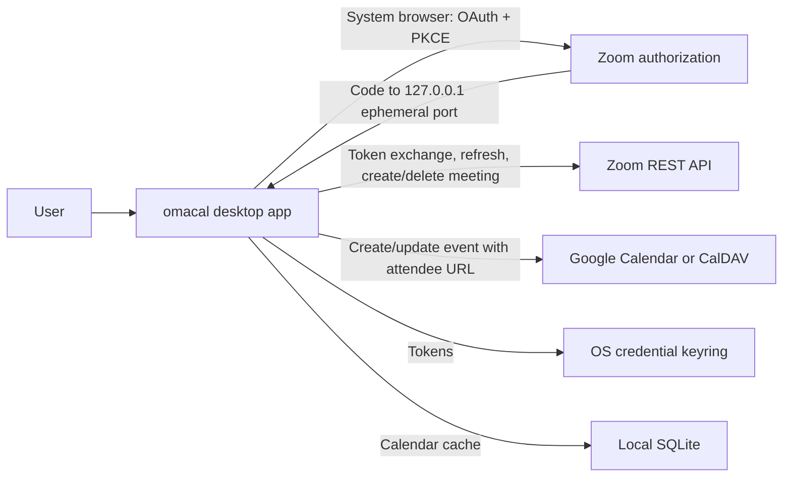

# Shipping omacal's Zoom connection

This is the production configuration and review checklist for the Zoom app owned and published by **Extreme Labs**. It describes the desktop PKCE flow in the code, not a second web-based authorization path.

Zoom's current terms call this a **General app**, **user-managed**, added **from the Marketplace**. Enable **Public Client OAuth** and use its separate public client id. omacal never receives or ships the confidential client secret: it generates an S256 PKCE verifier for every connection.

Listing is a discoverability choice, not an authentication requirement. An unlisted external app still needs production credentials and review. Because the configuration and review work are substantially the same, Extreme Labs intends to list omacal; the app's normal install path remains the omacal desktop app, not a web service.

## OAuth fields

Use these values on both Development and Production, with each environment's own generated public client id:

| Marketplace field | Value |
| --- | --- |
| App management | User-managed |
| Add method | From Marketplace |
| Public Client OAuth | On |
| Authorization | Authorization Code + PKCE (S256) |
| Redirect URL for OAuth | `http://127.0.0.1` |
| OAuth allow list | `http://127.0.0.1` |
| Scopes | `meeting:write:meeting`, `meeting:delete:meeting` |

The numeric loopback address is intentional; do not substitute `localhost`, an `extremelabs.io` URL, or a fixed port. omacal binds to `127.0.0.1:0`, reads the ephemeral port selected by the OS, and sends a URI such as `http://127.0.0.1:52936`. For eligible native/PKCE clients Zoom matches the registered loopback URI while ignoring only the port. The listener is bound before the browser opens, validates OAuth `state`, exchanges the code with the original verifier, and closes after the redirect.

This is the flow Zoom documents in [Using a loopback redirect URI](https://developers.zoom.us/docs/integrations/oauth/#using-a-loopback-redirect-uri). The broader Marketplace guidance that ordinarily requires HTTPS/FQDN callback URLs does not replace the documented native-PKCE loopback exception.

The `extremelabs.io` domain belongs only to listing and publisher material: homepage, support, self-serve documentation, privacy policy, and terms. Zoom may require ownership verification because those URLs use that domain; it is not inferred from omacal's OAuth redirect. Point the form at the final Extreme Labs pages, for example:

- product/documentation: `https://extremelabs.io/omacal`
- privacy: `https://extremelabs.io/omacal/privacy`
- terms: `https://extremelabs.io/omacal/terms`
- support: `https://extremelabs.io/omacal/support`

The company name on all four pages must match **Extreme Labs**. Zoom requires published apps to provide terms, privacy, self-serve documentation, a support URL, and a monitored developer contact. See [App distribution](https://developers.zoom.us/docs/distribute/) and [supporting published apps](https://developers.zoom.us/docs/distribute/published-apps/support/).

## Technology stack text for the review form

Use this text in Technical Design / Technology Stack:

> omacal is a local-first desktop application built with Tauri 2. Its user interface is Svelte 5 and TypeScript rendered in the operating system webview. Its application backend is Rust using Tokio and reqwest. Local calendar data is cached in SQLite and OAuth refresh/access tokens are stored in the operating system credential keyring. There is no omacal application server and Zoom credentials never pass through Extreme Labs infrastructure.
>
> Zoom authorization uses the system browser, an ephemeral HTTP listener bound only to 127.0.0.1, OAuth state validation, and Authorization Code with S256 PKCE using Zoom's public client id. The Rust process exchanges and refreshes tokens directly with zoom.us, then calls the Zoom REST API directly to create a scheduled meeting for the signed-in user. It writes the attendee join URL into the user's Google Calendar or CalDAV event. If that calendar write fails before the URL is attached, omacal deletes the newly created Zoom meeting as a best-effort compensation. Tokens and event data are not sent to Extreme Labs.

No architecture upload is necessary unless Zoom asks for one during review. The same data flow in compact form is:



## Build configuration

Development can override the embedded value in the untracked user config:

```toml
zoom_public_client_id = "DEVELOPMENT_PUBLIC_CLIENT_ID"
```

Release builds receive the **Production Public Client ID** through the GitHub Actions secret `OMACAL_ZOOM_PUBLIC_CLIENT_ID`:

```sh
OMACAL_ZOOM_PUBLIC_CLIENT_ID=… cargo tauri build
```

There is deliberately no Zoom client-secret build variable. `config.toml` wins when present, which lets a developer test their development app without changing an official build. A present config that omits the Zoom key also suppresses the embedded fallback, so use a complete local override or move the file aside when testing the release credential.

If credentials rotate, update the Marketplace app, replace the Actions secret, and publish a new omacal build. Existing refresh tokens remain in the OS keyring until Zoom rejects them or the user disconnects; omacal then asks the user to reconnect.

## Marketplace operations still owned outside this repository

Production publication needs the Extreme Labs Marketplace owner to complete domain verification and submission. If the build flow requires a deauthorization notification endpoint, it must be a small HTTPS endpoint on Extreme Labs infrastructure that validates Zoom's webhook signature and returns success. omacal stores no Zoom user data on an Extreme Labs server, so there is no server-side user record to delete; the endpoint documents and acknowledges that fact. A static page cannot receive this POST. Zoom describes the requirement under [OAuth deauthorization](https://developers.zoom.us/docs/integrations/oauth/#deauthorization).

Keep the Development and Production public client ids distinct. Reviewers use the Production credentials for the first publication request; development credentials remain for local testing and later update review.

## Local and reviewer end-to-end checklist

1. Confirm Public Client OAuth is enabled and both loopback fields contain `http://127.0.0.1`.
2. Put the Development Public Client ID in the local untracked config, launch omacal, and choose Settings → Accounts → Connect Zoom.
3. In the browser, approve the consent screen. Confirm the callback uses a numeric `127.0.0.1` address with a varying high port and omacal reports Zoom connected.
4. Create a timed Google event with Add Video Call → Zoom. Confirm exactly one scheduled meeting exists in Zoom and its attendee join URL is on the calendar event and opens from omacal.
5. Repeat on a writable CalDAV calendar. Confirm the URL survives a resync.
6. Exercise edit as well as create, including replacing a Google Meet link with Zoom.
7. Run the automated provider-failure tests. They assert one Zoom DELETE per failed calendar write, no DELETE after a committed write/read-back failure, and cleanup of each resource across a retry.
8. Disconnect Zoom in Settings and reconnect. Confirm rotated refresh tokens work and a revoked grant produces the explicit reconnect state.
9. Repeat steps 2–8 with a build carrying the Production Public Client ID before submitting the Marketplace review video/evidence.

The intentionally ignored provider round trip exercises the same PKCE path
with a real Marketplace app, creates one temporary meeting, and deletes it
before passing:

```sh
OMACAL_ZOOM_PUBLIC_CLIENT_ID=PUBLIC_CLIENT_ID \
OMACAL_LIVE_ZOOM=1 \
cargo test -p omacal \
  zoom::tests::live_marketplace_pkce_loopback_and_meeting_round_trip \
  --lib -- --ignored --exact
```

Run it interactively: Zoom opens the system browser for consent and the test
waits on the ephemeral loopback callback. A failure after meeting creation is
an instruction to remove that named test meeting manually before retrying.

Never paste access tokens, refresh tokens, the confidential client secret, or keyring output into review notes, screenshots, logs, or repository issues.
